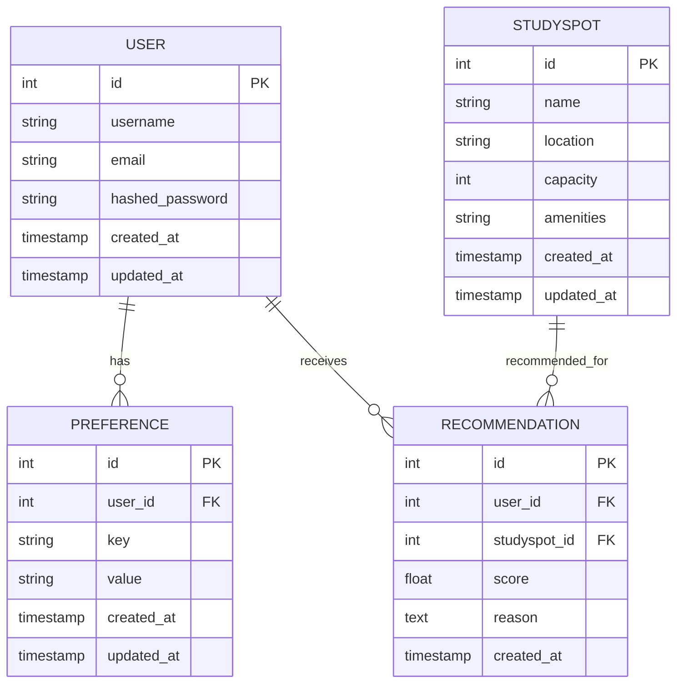

# Domain model — UWDialed

This document contains a domain model (ERD/UML) for the backend of UWDialed. It shows the primary entities, their core attributes, and the relationships between them. The goal is to provide a clear, reviewable artifact the team can approve and reference when implementing the database schema and API.

## Overview
Primary entities in this domain model:

- `User` — application user (student) who receives study spot recommendations and can set preferences.
- `StudySpot` — a place where students can study (location, capacity, amenities).
- `Preference` — user-specific preference keys/values used to influence recommendations (quiet, group-friendly, power outlets, etc.).
- `Recommendation` — scored recommendation linking a `User` to a `StudySpot` with metadata about why it was recommended.

This doc contains a Mermaid ER diagram (preferred for readable VCS text), a short narrative describing relationships, and example SQL table DDL snippets.

---

## Mermaid ER Diagram



> Note: Mermaid's `erDiagram` block is text-based and renders in many Markdown viewers (GitLab, VS Code with Mermaid preview). If your toolchain doesn't render Mermaid, see the ASCII/UML and SQL snippets below.

---

## Narrative (relationships)

- A `User` can have many `Preference` rows (1-to-many). Preferences store per-user configuration used to tailor recommendations.
- A `User` can receive many `Recommendation` rows (1-to-many). Each recommendation references a `StudySpot` and has a numeric `score` plus optional `reason` or metadata.
- A `StudySpot` can appear in many `Recommendation` rows (1-to-many), i.e., many users can be recommended the same study spot.

Constraints and cardinality summary:

- `Preference.user_id` is a foreign key referencing `User.id` (ON DELETE CASCADE or RESTRICT as desired).
- `Recommendation.user_id` references `User.id` and `Recommendation.studyspot_id` references `StudySpot.id`.

---

## Example SQL (Postgres-flavored) — suggested tables

-- Users
```sql
CREATE TABLE users (
  id SERIAL PRIMARY KEY,
  username TEXT NOT NULL UNIQUE,
  email TEXT NOT NULL UNIQUE,
  hashed_password TEXT,
  created_at TIMESTAMP WITH TIME ZONE DEFAULT now(),
  updated_at TIMESTAMP WITH TIME ZONE DEFAULT now()
);
```

-- StudySpots
```sql
CREATE TABLE study_spots (
  id SERIAL PRIMARY KEY,
  name TEXT NOT NULL,
  location TEXT,
  capacity INTEGER,
  amenities TEXT,
  created_at TIMESTAMP WITH TIME ZONE DEFAULT now(),
  updated_at TIMESTAMP WITH TIME ZONE DEFAULT now()
);
```

-- Preferences
```sql
CREATE TABLE preferences (
  id SERIAL PRIMARY KEY,
  user_id INTEGER NOT NULL REFERENCES users(id) ON DELETE CASCADE,
  key TEXT NOT NULL,
  value TEXT NOT NULL,
  created_at TIMESTAMP WITH TIME ZONE DEFAULT now(),
  updated_at TIMESTAMP WITH TIME ZONE DEFAULT now()
);
```

-- Recommendations
```sql
CREATE TABLE recommendations (
  id SERIAL PRIMARY KEY,
  user_id INTEGER NOT NULL REFERENCES users(id) ON DELETE CASCADE,
  studyspot_id INTEGER NOT NULL REFERENCES study_spots(id) ON DELETE CASCADE,
  score DOUBLE PRECISION NOT NULL,
  reason TEXT,
  created_at TIMESTAMP WITH TIME ZONE DEFAULT now()
);
```

Notes:
- Index user-facing lookup columns (e.g., `preferences(user_id)`, `recommendations(user_id)`, `recommendations(studyspot_id)`).
- Consider additional tables for history, feedback (e.g., `recommendation_feedback`), or aggregated metrics.

---
